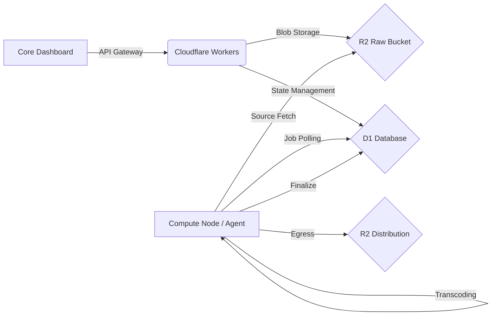

# Version: v1.0.0 — The Factory Birth

---

## English (Global Operations)

# Video-factory: Enterprise Video Lifecycle Management
A robust, distributed video processing ecosystem engineered for low-latency delivery and high-availability storage. Built on a serverless Cloudflare Workers backbone with R2 Object Storage and D1 Relational DB.

### Technical Value Pillars

#### 1. Native Notification Engine
A standalone, zero-dependency notification system providing asynchronous status feedback. Decoupled from core business logic to ensure consistent UX during high-load processing states.

#### 2. BKEventManager (Memory-Safe SPA Handling)
A proprietary event orchestration layer designed for Single Page Applications. Implements strict garbage collection patterns for event listeners, eliminating common memory leaks during client-side navigation.

#### 3. Modular Service Architecture
High-granularity routing and service separation:
- **Video Ingestion**: Optimized multipart upload handlers for R2.
- **Remote Acquisition**: Server-side URL import protocols with security sanitization.
- **Resource Indexing**: Intelligent metadata extraction and relational mapping via D1.

#### 4. Storage Optimization: Nuke Protocol
A strategic R2 optimization toolset. Automatically mitigates object storage bloat by identifying orphaned raw assets and terminating abandoned multipart uploads beyond the 24-hour retention window.

### System Architecture

#### Processing Pipeline

#### Directory Overview
- `src/routes`: API boundary and role-based access control.
- `src/services`: Core logic (Transcription, Deletion, Lifecycle).
- `src/repositories`: Data persistence and FTS5 search integration.
- `public`: Enterprise-grade management dashboard.

---

## Türkçe (Kurumsal Operasyonlar)

# Video-factory: Kurumsal Video Yaşam Döngüsü Yönetimi
Düşük gecikmeli teslimat ve yüksek erişilebilirlikli depolama için tasarlanmış, dağıtık bir video işleme ekosistemi. Cloudflare Workers mimarisi üzerine kurulu; R2 Nesne Depolama ve D1 İlişkisel Veritabanı ile güçlendirilmiştir.

### Mühendislik İlkeleri ve Kritik Çözümler

#### 1. Yerel Bildirim Motoru (Native Notification Engine)
Asenkron durum geri bildirimi sağlayan, bağımsız ve düşük kaynak tüketen bildirim sistemi. İşlem yoğunluğundan bağımsız olarak kullanıcı deneyimini kesintisiz tutmak için ana iş mantığından izole edilmiştir.

#### 2. BKEventManager (Bellek Yönetimli Olay Katmanı)
Tek Sayfa Uygulamaları (SPA) için geliştirilmiş özel olay yönetim katmanı. Listener yönetimi için katı çöp toplama (garbage collection) standartları uygulayarak istemci tarafındaki bellek sızıntılarını tamamen ortadan kaldırır.

#### 3. Modüler Servis Mimarisi
Parçalanmış ve yüksek ölçeklenebilir yapı:
- **Veri Girişi (Ingestion)**: R2 için optimize edilmiş çok parçalı yükleme (multipart upload) yöneticileri.
- **Uzak Kaynak Alımı**: Güvenlik filtrelerinden geçirilmiş sunucu tarafı URL aktarım protokolleri.
- **İndeksleme**: D1 üzerinden yürütülen akıllı meta veri çıkarma ve ilişkisel haritalama.

#### 4. Depolama Verimliliği: Nuke Protokolü
R2 maliyetlerini optimize eden akıllı temizlik aracı. Yetim kalan ham dosyaları ve 24 saati aşan sahipsiz yükleme işlemlerini otomatik olarak tespit ederek depolama maliyetlerini düşürür.

### Sistem Görselleştirmesi

#### Operasyonel İş Akışı
(Yukarıdaki Mermaid diyagramında belirtildiği gibi: Dashboard -> Worker -> R2/D1 -> Agent -> Dağıtım.)

#### Proje Yapılandırması
- `src/routes`: API sınırları ve yetkilendirme katmanı.
- `src/services`: Temel iş mantığı (Job, Deletion, Lifecycle).
- `src/repositories`: Veri kalıcılığı ve FTS5 hızlı arama desteği.
- `public`: Kurumsal yönetim paneli ve SPA arayüzü.
