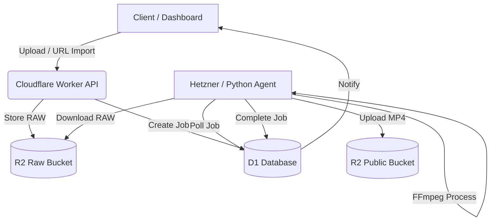
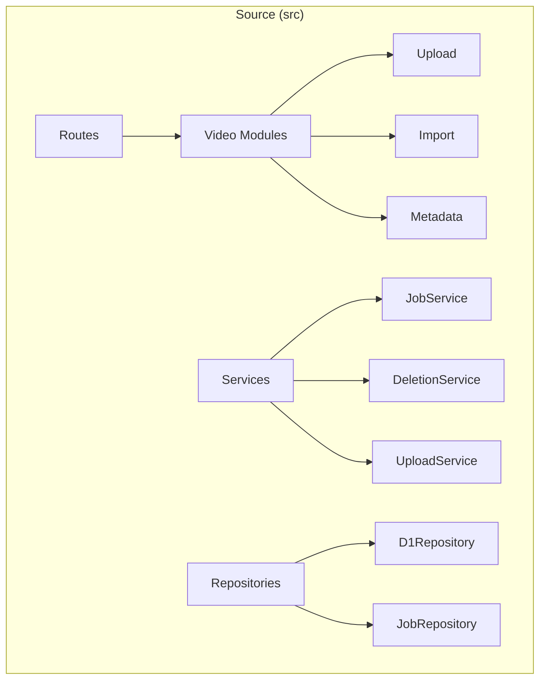

# Version: v1.0.0 - The Factory Birth

---

## 🇬🇧 English Documentation

# Video-factory
A standalone, high-performance video processing and management system built on Cloudflare Workers, R2 Storage, and D1 Database.

### 🚀 Key Features

*   **Standalone Notification System**: An integrated real-time toast notification mechanism for instant feedback on system operations and job statuses.
*   **BKEventManager**: A sophisticated SPA event manager designed to prevent memory leaks by centralizing listener management and ensuring clean view transitions.
*   **Modular Architecture**: Clean separation of concerns with dedicated modules for:
    *   **Upload**: High-speed presigned R2 uploads.
    *   **Import**: Server-side URL import logic.
    *   **Metadata**: Intelligent video metadata extraction and indexing.
*   **Nuke RAW Protocol**: A smart cleanup tool that optimizes storage costs by identifying and purging orphaned raw files and abandoned multipart uploads in R2.

### 📊 System Visualization

#### System Flow Diagram


#### Modular Structure


### 🛠 Installation & Setup

1.  **Clone the repository**:
    ```bash
    git clone https://github.com/your-repo/video-factory.git
    ```
2.  **Install dependencies**:
    ```bash
    npm install
    ```
3.  **Environment Variables**:
    *   Copy `.env.example` to `.dev.vars` (for local development).
    *   Set up Cloudflare D1 and R2 bindings in `wrangler.toml`.

### 🛡 Security & Compliance
*   **No Hardcoded Secrets**: Always use Cloudflare Secrets or encrypted variables.
*   **Access Control**: Implements root and admin-level role segregation.
*   **Data Integrity**: Foreign key constraints and transaction-safe operations in D1.

---

## 🇹🇷 Türkçe Dokümantasyon

# Video-factory
Cloudflare Workers, R2 Storage ve D1 Database üzerine inşa edilmiş; bağımsız, yüksek performanslı bir video işleme ve yönetim sistemidir.

### 🚀 Öne Çıkan Özellikler

*   **Standalone Bildirim Sistemi**: İşlem durumlarını ve sistem mesajlarını anlık olarak ileten, entegre toast bildirim mekanizması.
*   **BKEventManager**: Sayfalar arası geçişte bellek sızıntılarını önleyen, merkezi dinleyici yönetimi sağlayan SPA olay yöneticisi.
*   **Modüler Mimari**: Aşağıdaki servisler için parçalanmış ve optimize edilmiş yapı:
    *   **Upload**: R2 presigned destekli hızlı yükleme.
    *   **Import**: Sunucu tarafı URL import mantığı.
    *   **Metadata**: Akıllı video meta verisi çıkarma ve indeksleme.
*   **Nuke RAW Protokolü**: R2 depolama maliyetlerini optimize eden; yetim kalan raw dosyaları ve yarım kalmış multipart yüklemeleri tespit edip temizleyen akıllı araç.

### 📊 Sistem Görselleştirmesi

#### Sistem Akış Şeması
(Yukarıdaki İngilizce bölümdeki Mermaid diyagramı ile aynı akışı takip eder: Yükleme -> İşleme -> Depolama.)

#### Modüler Dosya Yapısı Şeması
*   `src/routes`: API uç noktaları ve modüler yönlendirme.
*   `src/services`: İş mantığı (Job, Deletion, Upload servisleri).
*   `src/repositories`: Veritabanı erişim katmanı (D1, Job, User repoları).
*   `public`: Modern SPA dashboard ve görsel arayüz.

### 🛠 Kurulum ve Yapılandırma

1.  **Projeyi Klonlayın**:
    ```bash
    git clone https://github.com/your-repo/video-factory.git
    ```
2.  **Bağımlılıkları Yükleyin**:
    ```bash
    npm install
    ```
3.  **Çevresel Değişkenler**:
    *   `.env.example` dosyasını `.dev.vars` olarak kopyalayın.
    *   `wrangler.toml` içerisinden D1 ve R2 binding'lerini yapılandırın.

### 🛡 Güvenlik Korumaları
*   **Gizlilik**: Gerçek şifreleri veya hassas ID'leri asla kod içerisine yazmayın.
*   **Erişim**: Root ve Admin rollerine dayalı yetkilendirme sistemi.
*   **Temizlik**: `.gitignore` dosyasının doğru yapılandırıldığından emin olun ve hassas dosyaları commit etmeyin.
