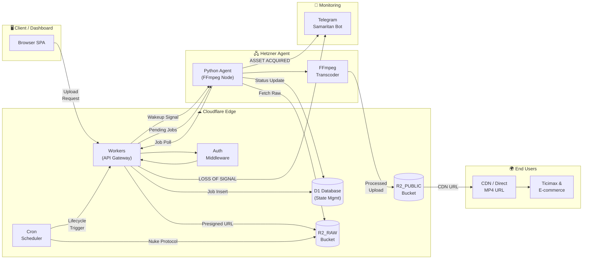
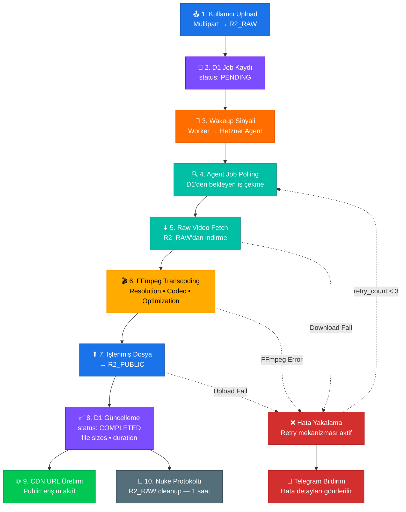
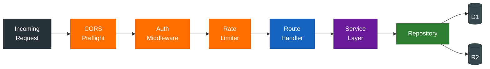
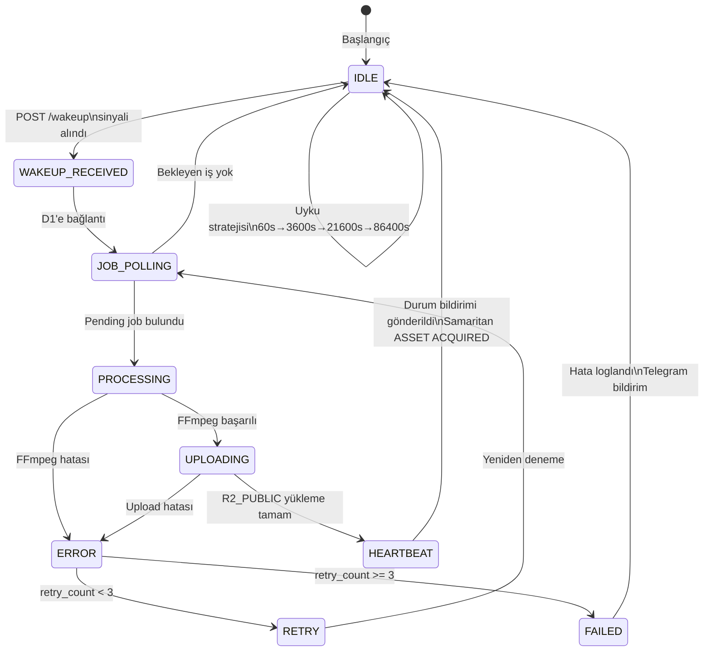
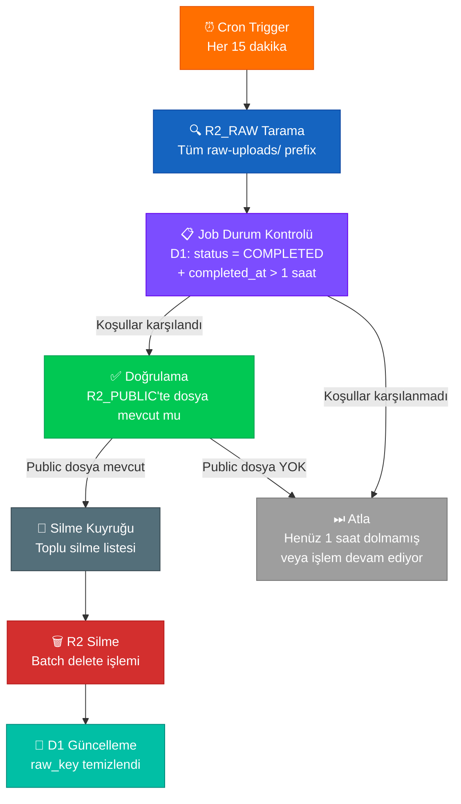
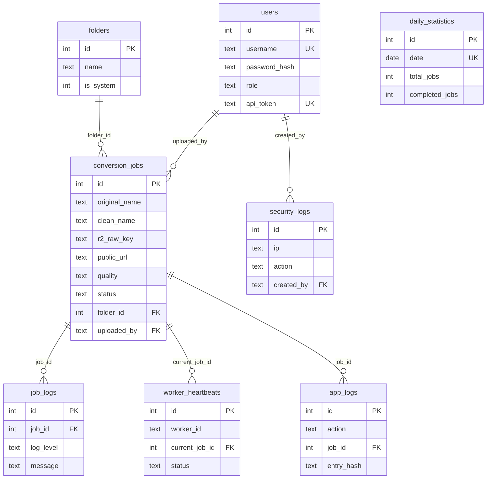
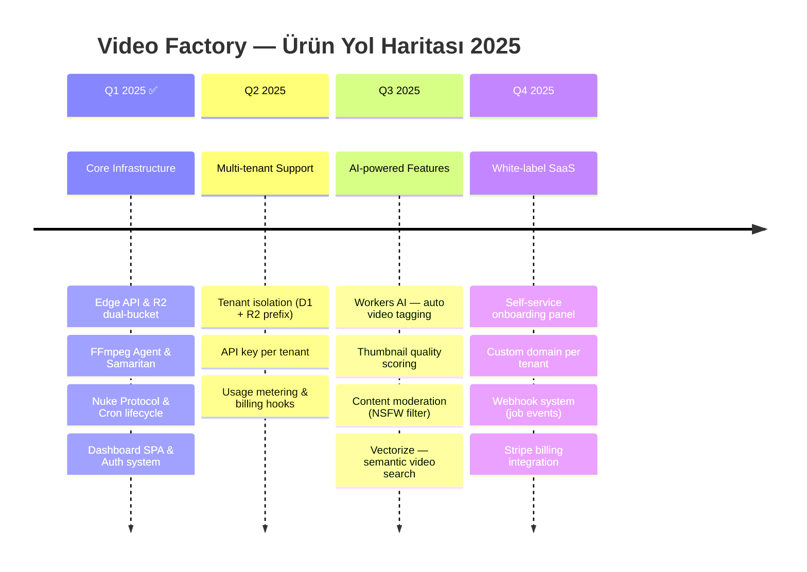

<p align="center">
  
</p>

<h1 align="center">⚡ Video Factory</h1>

<p align="center">
  <strong>Serverless Video Processing Infrastructure at the Edge</strong>
</p>

<p align="center">
  <a href="#"></a>
  <a href="#"></a>
  <a href="#"></a>
  <a href="#"></a>
  <a href="#"></a>
  <a href="#"></a>
</p>

<p align="center">
  E-ticaret ve içerik üretimi için tasarlanmış, uçtan uca serverless video işleme altyapısı.<br/>
  Cloudflare Edge üzerinde yükleme, FFmpeg ile otomatik transkod, küresel CDN dağıtımı — tek pipeline'da.<br/>
  <em>"R2 > Database" felsefesi: depolama katmanı gerçeğin tek kaynağı.</em>
</p>

---

## 🏗 Mimari Genel Bakış

Sistem üç ana katmandan oluşur: **Edge** (Cloudflare Workers, R2, D1), **Processing** (Hetzner Python Agent + FFmpeg) ve **Monitoring** (Samaritan / Telegram). Tüm bileşenler arasındaki veri akışı aşağıda gösterilmektedir.



---

## 🔄 İşleme Pipeline'ı

Bir video dosyasının sisteme girişinden nihai CDN dağıtımına kadar geçtiği tüm adımlar:



---

## 📐 Bileşen Mimarisi

### 4a. Cloudflare Workers — Route & Middleware Zinciri

Tek Worker hem API'yi hem SPA'yı sunar. 15 öncelik seviyeli route zinciri:



**Katmanlı Mimari:**

| Katman | Sorumluluk | Dosya(lar) |
|--------|-----------|------------|
| **Middleware** | CORS, Auth (Bearer/Cookie), Rate Limit, IP Ban | `src/middleware/` |
| **Routes** | HTTP dispatch, request validation, response format | `src/routes/` (14 modül) |
| **Services** | Business logic, orchestration | `src/services/` (12 modül) |
| **Repositories** | D1/R2 CRUD, query builder | `src/repositories/` (15 modül) |

---

### 4b. Hetzner Agent — State Machine

Agent'ın tam yaşam döngüsü ve hata kurtarma mekanizması:



**Agent Konfigürasyonu:**

| Parametre | Varsayılan | Açıklama |
|-----------|-----------|----------|
| Concurrency | 4 thread | `ThreadPoolExecutor` paralel iş |
| Uyku Stratejisi | Active→Idle→Deep1→Deep2 | 60s → 3600s → 21600s → 86400s |
| Heartbeat | 5 dk | Samaritan ping aralığı |
| Wakeup Port | 8080 | `POST /wakeup` (Bearer auth) |

---

### 4c. Nuke Protokolü — Otomatik Temizleme

Maliyet optimizasyonu için R2_RAW bucket'taki tamamlanmış işlerin ham dosyaları otomatik silinir:



---

### 4d. Veri Modeli — Entity Relationship

D1 tablolarının ve R2 bucket'larının ilişkisel yapısı:



---

## 🧱 Altyapı Planı

### Servis Karşılaştırma Tablosu

| Bileşen | Kullanılan Servis | Alternatif | Neden Bu Seçim |
|---------|:----------------:|:----------:|----------------|
| **API Gateway** | Cloudflare Workers | AWS Lambda + API GW | 0 ms cold start, küresel edge dağıtımı, Workers Free Tier: 100K istek/gün |
| **Object Storage** | Cloudflare R2 | AWS S3 | Sıfır egress ücreti — video dağıtımında %60-80 maliyet düşüşü |
| **Database** | Cloudflare D1 | PlanetScale, Turso | Workers binding ile <1 ms latency, SQLite uyumluluğu, FTS5 desteği |
| **Video Processing** | Hetzner VPS + FFmpeg | AWS MediaConvert, Mux | €4.5/ay'dan dedike CPU; MediaConvert dk başı ücret, FFmpeg tam kontrol |
| **CDN** | Cloudflare CDN (R2 custom domain) | AWS CloudFront | R2 egress = $0, otomatik edge cache, custom domain desteği |
| **Monitoring** | Telegram Bot (Samaritan) | PagerDuty, Datadog | Ücretsiz, anlık mobil bildirim, webhook entegrasyonu, komut desteği |
| **CI/CD** | GitHub Actions + Wrangler | GitLab CI, CircleCI | Native Cloudflare deploy, D1 migration, ücretsiz tier yeterli |

### Maliyet Optimizasyon Tablosu

| Senaryo | Aylık Video | Aylık İstek (API + CDN) | Tahmini Maliyet | Optimizasyon Notları |
|---------|:-----------:|:----------------------:|:---------------:|---------------------|
| **Starter** | 1.000 video | ~50K API + 500K CDN | **~$9/ay** | Workers Free (100K/gün), R2 Free (10 GB), Hetzner CAX11 €4.5, D1 Free (5M read) |
| **Growth** | 10.000 video | ~500K API + 5M CDN | **~$32/ay** | Workers Paid ($5), R2 ~$7 (100 GB storage), Hetzner CAX21 €8.5, D1 $5 |
| **Scale** | 100.000 video | ~5M API + 50M CDN | **~$145/ay** | Workers Paid ($5 + overage), R2 ~$45 (1 TB), Hetzner CAX31 €15, Nuke Protocol ile R2_RAW %0 kalıcı |

> **Kıyaslama:** Aynı 10K video/ay hacmi Mux'ta ~$500/ay, AWS MediaConvert + S3 + CloudFront'ta ~$280/ay'a mal olur. Video Factory bu maliyeti **%90'a kadar** düşürür.

---

## 🚀 Hızlı Başlangıç

### Gereksinimler

| Araç | Minimum Versiyon | Açıklama |
|------|:----------------:|----------|
| Node.js | 18+ | Worker geliştirme ortamı |
| Wrangler CLI | 3.0+ | `npm i -g wrangler` |
| Python | 3.10+ | Hetzner Agent |
| FFmpeg | 6.0+ | Video transcoding |
| Cloudflare Hesabı | — | Workers, R2, D1 erişimi |
| Hetzner VPS | CAX11+ | ARM veya x86, min 4 GB RAM |

### Ortam Değişkenleri

```bash
# .dev.vars (Cloudflare Worker — lokal geliştirme)
BK_BEARER_TOKEN=your_secure_bearer_token
HETNER_API_KEY=your_agent_api_key
R2_ACCOUNT_ID=your_cloudflare_account_id
R2_ACCESS_KEY_ID=your_r2_access_key
R2_SECRET_ACCESS_KEY=your_r2_secret_key
TELEGRAM_TOKEN=your_telegram_bot_token
TELEGRAM_CHAT_ID=your_admin_chat_id
SAMARITAN_SECRET=your_samaritan_secret

# .env (Hetzner Agent)
BK_API_URL=https://your-domain.com
BK_BEARER_TOKEN=same_bearer_token_as_worker
TELEGRAM_TOKEN=same_telegram_bot_token
TELEGRAM_CHAT_ID=same_admin_chat_id
```

### Adım 1 — Cloudflare Altyapısı

```bash
# Wrangler ile giriş yapın
wrangler login

# D1 veritabanı oluşturun
wrangler d1 create bk-video-db
# Çıktıdaki database_id'yi wrangler.toml'a yazın

# R2 bucket'ları oluşturun
wrangler r2 bucket create bk-video-raw
wrangler r2 bucket create bk-video-public
wrangler r2 bucket create bk-video-deleted

# R2 CORS politikası uygulayın
wrangler r2 bucket cors put bk-video-raw --rules ./r2-cors.json
wrangler r2 bucket cors put bk-video-public --rules ./r2-cors.json

# D1 migration'ları çalıştırın
wrangler d1 migrations apply bk-video-db

# Secret'ları tanımlayın
wrangler secret put BK_BEARER_TOKEN
wrangler secret put R2_ACCOUNT_ID
wrangler secret put R2_ACCESS_KEY_ID
wrangler secret put R2_SECRET_ACCESS_KEY
wrangler secret put TELEGRAM_TOKEN
wrangler secret put TELEGRAM_CHAT_ID
wrangler secret put SAMARITAN_SECRET
```

### Adım 2 — Worker Deploy

```bash
# Lokal geliştirme
npm install
npm run dev

# Production deploy
npm run deploy
```

### Adım 3 — Hetzner Agent Kurulumu

```bash
# Agent dosyalarını sunucuya kopyalayın
scp -r hetner-agent/ root@your-server:/opt/video-factory/

# Sunucuya bağlanın
ssh root@your-server

# Bağımlılıkları kurun
cd /opt/video-factory
pip install -r requirements.txt
apt install -y ffmpeg

# .env dosyasını oluşturun
cp .env.example .env
nano .env  # Değerleri doldurun

# Agent'ı başlatın (systemd ile)
cat > /etc/systemd/system/video-agent.service << 'EOF'
[Unit]
Description=Video Factory Processing Agent
After=network.target

[Service]
Type=simple
User=root
WorkingDirectory=/opt/video-factory
ExecStart=/usr/bin/python3 bk_agent_v2.py
Restart=always
RestartSec=10
Environment=PYTHONUNBUFFERED=1

[Install]
WantedBy=multi-user.target
EOF

systemctl daemon-reload
systemctl enable video-agent
systemctl start video-agent
```

### Adım 4 — Telegram Bot Bağlantısı

```bash
# BotFather'dan token alın, ardından webhook'u ayarlayın:
curl -X POST "https://api.telegram.org/bot<TOKEN>/setWebhook" \
  -d "url=https://your-domain.com/api/telegram/webhook"

# Doğrulama:
curl "https://api.telegram.org/bot<TOKEN>/getWebhookInfo"
```

---

## 📡 API Referansı

### Kimlik Doğrulama

```http
POST /api/login
Content-Type: application/json
```

| Parametre | Tip | Zorunlu | Açıklama |
|-----------|-----|:-------:|----------|
| `username` | string | ✅ | Kullanıcı adı |
| `password` | string | ✅ | Şifre |

**Response:**
```json
{
  "success": true,
  "token": "eyJhbGciOiJIUzI1NiIs...",
  "user": {
    "username": "admin",
    "role": "root"
  }
}
```

---

### Video Yükleme (Presigned URL)

```http
POST /api/videos/upload/presigned
Authorization: Bearer {token}
Content-Type: application/json
```

| Parametre | Tip | Zorunlu | Açıklama |
|-----------|-----|:-------:|----------|
| `filename` | string | ✅ | Orijinal dosya adı |
| `quality` | string | ✅ | `720p` veya `1080p` |
| `folder_id` | integer | ❌ | Hedef klasör ID |
| `tags` | string | ❌ | Virgülle ayrılmış etiketler |
| `project_name` | string | ❌ | Proje adı |

**Response:**
```json
{
  "success": true,
  "jobId": 142,
  "uploadUrl": "https://bk-video-raw.r2.cloudflarestorage.com/raw-uploads/...",
  "uploadToken": "tok_abc123...",
  "method": "PUT"
}
```

---

### Upload Tamamlama

```http
POST /api/videos/upload/complete
Authorization: Bearer {token}
Content-Type: application/json
```

| Parametre | Tip | Zorunlu | Açıklama |
|-----------|-----|:-------:|----------|
| `uploadToken` | string | ✅ | Presigned aşamasından alınan token |
| `jobId` | integer | ✅ | İş ID |

**Response:**
```json
{
  "success": true,
  "job": {
    "id": 142,
    "status": "PENDING",
    "clean_name": "urun-tanitim-video"
  }
}
```

---

### URL'den Video Import

```http
POST /api/videos/upload/from-url
Authorization: Bearer {token}
Content-Type: application/json
```

| Parametre | Tip | Zorunlu | Açıklama |
|-----------|-----|:-------:|----------|
| `url` | string | ✅ | Kaynak video URL'si |
| `quality` | string | ✅ | `720p` veya `1080p` |
| `folder_id` | integer | ❌ | Hedef klasör |

**Response:**
```json
{
  "success": true,
  "jobId": 143,
  "message": "URL import başlatıldı"
}
```

---

### Video Listeleme

```http
GET /api/videos?status=COMPLETED&folder_id=2&page=1&limit=20
Authorization: Bearer {token}
```

| Query Param | Tip | Varsayılan | Açıklama |
|-------------|-----|:----------:|----------|
| `status` | string | — | `PENDING`, `PROCESSING`, `COMPLETED`, `FAILED` |
| `folder_id` | integer | — | Klasör filtresi |
| `page` | integer | `1` | Sayfa numarası |
| `limit` | integer | `20` | Sayfa başına sonuç |
| `search` | string | — | FTS5 arama (isim, tag, proje) |

**Response:**
```json
{
  "success": true,
  "data": [
    {
      "id": 142,
      "clean_name": "urun-tanitim-video",
      "status": "COMPLETED",
      "public_url": "https://cdn.bilgekarga.tr/videos/2025/02/142_urun-tanitim-video.mp4",
      "thumbnail_url": "https://cdn.bilgekarga.tr/thumbnails/142/urun-tanitim-video-thumb.jpg",
      "file_size_output": 8456789,
      "duration": 45,
      "compression_percentage": 62.3
    }
  ],
  "pagination": { "page": 1, "limit": 20, "total": 87 }
}
```

---

### Job Claim (Agent)

```http
POST /api/jobs/claim
Authorization: Bearer {agent_token}
Content-Type: application/json
```

| Parametre | Tip | Zorunlu | Açıklama |
|-----------|-----|:-------:|----------|
| `worker_id` | string | ✅ | Agent tanımlayıcısı |

**Response:**
```json
{
  "success": true,
  "job": {
    "id": 142,
    "r2_raw_key": "raw-uploads/1708891234-142-video.mp4",
    "quality": "1080p",
    "clean_name": "urun-tanitim-video"
  }
}
```

---

### Hata Kodları

| Kod | Açıklama |
|:---:|----------|
| `400` | Eksik veya hatalı parametre |
| `401` | Geçersiz veya eksik Bearer token |
| `403` | Yetkisiz erişim (rol yetersiz) |
| `404` | Kaynak bulunamadı |
| `409` | Çakışma (duplicate slug, aktif upload) |
| `413` | Dosya boyutu limiti aşıldı (5 GB) |
| `429` | Rate limit aşıldı |
| `500` | Sunucu hatası — Samaritan otomatik bildirim gönderir |

---

## 🚢 Deployment Mimarisi

Production CI/CD pipeline akışı:

```mermaid
flowchart LR
    Push["GitHub\nPush"]:::git
    Actions["GitHub\nActions"]:::ci
    Wrangler["Wrangler\nDeploy"]:::deploy
    Migration["D1\nMigration"]:::db
    CORS["R2 CORS\nConfig"]:::config
    AgentDeploy["Agent\nDeploy\n(SSH)"]:::agent
    Health["Health\nCheck"]:::health
    Notify["Telegram\nDeploy\nNotification"]:::notify

    Push --> Actions
    Actions --> Wrangler
    Wrangler --> Migration
    Migration --> CORS
    CORS --> AgentDeploy
    AgentDeploy --> Health
    Health --> Notify

    classDef git fill:#24292e,stroke:#1b1f23,color:#fff
    classDef ci fill:#2088ff,stroke:#0366d6,color:#fff
    classDef deploy fill:#f38020,stroke:#e06d10,color:#fff
    classDef db fill:#7c4dff,stroke:#6200ea,color:#fff
    classDef config fill:#00bfa5,stroke:#00897b,color:#fff
    classDef agent fill:#546e7a,stroke:#37474f,color:#fff
    classDef health fill:#00c853,stroke:#00a152,color:#fff
    classDef notify fill:#0088cc,stroke:#006699,color:#fff
```



**Deploy Komutları:**

```bash
# Worker deploy (wrangler.toml production)
wrangler deploy

# D1 migration (otomatik)
wrangler d1 migrations apply bk-video-db

# Agent güncelleme
ssh root@agent-server "cd /opt/video-factory && git pull && systemctl restart video-agent"
```

---

## 📊 İzleme ve Gözlemlenebilirlik

Samaritan sistemi 7 farklı alarm tipi ile tam gözlemlenebilirlik sağlar. Tüm bildirimler Telegram üzerinden anlık iletilir.

### İş Tamamlandı Bildirimi
```
🎬 ASSET ACQUIRED
[ > ] FILE: urun-tanitim-2025.mp4
[ > ] QUALITY: 1080p
[ > ] INPUT: 245 MB → OUTPUT: 92 MB (↓ %62.4)
[ > ] DURATION: 45s
[ > ] PROCESSING: 2m 18s
> STATUS: READY FOR DEPLOYMENT.
> CDN: https://cdn.bilgekarga.tr/videos/2025/02/142_urun-tanitim.mp4
```

### Hata Bildirimi
```
🔺 SYSTEM ANOMALY DETECTED
[ \ ] TARGET NODE: Cloudflare Edge Worker
[ ! ] CRITICAL ERROR: R2 upload timeout after 3 retries
[ \ ] JOB_ID: 142
[ \ ] STAGE: UPLOADING
> STATUS: SYSTEM OVERRIDE NEEDED. SEARCHING FOR ADMIN... 🔎
```

### Nuke Protokolü Raporu
```
🧹 NUKE PROTOCOL EXECUTED
[ > ] SCANNED: 47 raw files
[ > ] ELIGIBLE: 12 files (completed > 1 hour)
[ > ] DELETED: 12 files
[ > ] FREED: 3.2 GB storage
[ > ] SKIPPED: 35 files (in-progress or recent)
> STATUS: R2_RAW OPTIMIZED. COST SAVINGS APPLIED.
```

### Sinyal Kaybı Alarmı
```
🔻 CRITICAL ALERT: LOSS OF SIGNAL
[ \ ] TARGET NODE: Primary Processing Core (Hetzner)
[ ! ] STATUS: MISSING 2 CONSECUTIVE HEARTBEATS.
[ \ ] LAST SEEN: 2025-02-14T08:23:00Z (14 min ago)
> DIRECTIVE: NODE PRESUMED DEAD. INITIATING ADMIN WAKE-UP ALARM! 🚨
```

### Günlük Sistem Özeti
```
📊 DAILY SYSTEM REPORT — 2025-02-14
━━━━━━━━━━━━━━━━━━━━
[ > ] PROCESSED: 127 videos
[ > ] SUCCESS RATE: 98.4% (125/127)
[ > ] TOTAL INPUT: 31.2 GB
[ > ] TOTAL OUTPUT: 11.8 GB (↓ %62.2 avg compression)
[ > ] AVG PROCESSING: 1m 42s
[ > ] STORAGE FREED (Nuke): 28.4 GB
[ > ] ACTIVE AGENT UPTIME: 23h 58m
━━━━━━━━━━━━━━━━━━━━
> STATUS: ALL SYSTEMS NOMINAL ✅
```

---

## 🗺 Yol Haritası



---

## 🤝 Katkıda Bulunma

Projeye katkıda bulunmak istiyorsanız:

1. Bu repository'yi fork edin
2. Feature branch oluşturun (`git checkout -b feature/amazing-feature`)
3. Değişikliklerinizi commit edin (`git commit -m 'feat: add amazing feature'`)
4. Branch'inizi push edin (`git push origin feature/amazing-feature`)
5. Pull Request açın

Detaylı katkı rehberi için [CONTRIBUTING.md](CONTRIBUTING.md) dosyasına bakın.

---

## 📄 Lisans

Bu proje [MIT License](LICENSE) ile lisanslanmıştır.

```
MIT License

Copyright (c) 2025 Video Factory

Permission is hereby granted, free of charge, to any person obtaining a copy
of this software and associated documentation files (the "Software"), to deal
in the Software without restriction, including without limitation the rights
to use, copy, modify, merge, publish, distribute, sublicense, and/or sell
copies of the Software, and to permit persons to whom the Software is
furnished to do so, subject to the following conditions:

The above copyright notice and this permission notice shall be included in all
copies or substantial portions of the Software.
```

---

<p align="center">
  <sub>Mühendislik ekibi tarafından 🇹🇷 İstanbul'dan tasarlandı ve inşa edildi.</sub><br/>
  <sub>Powered by Cloudflare Workers · R2 · D1 · FFmpeg</sub>
</p>
