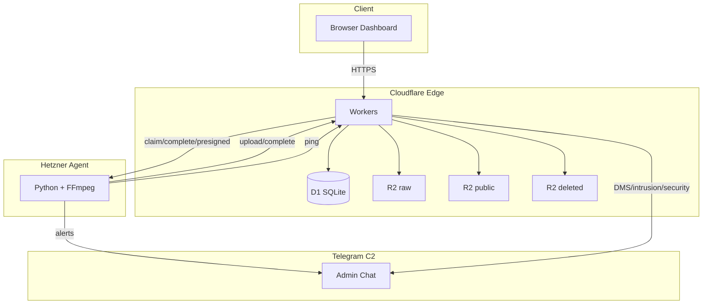
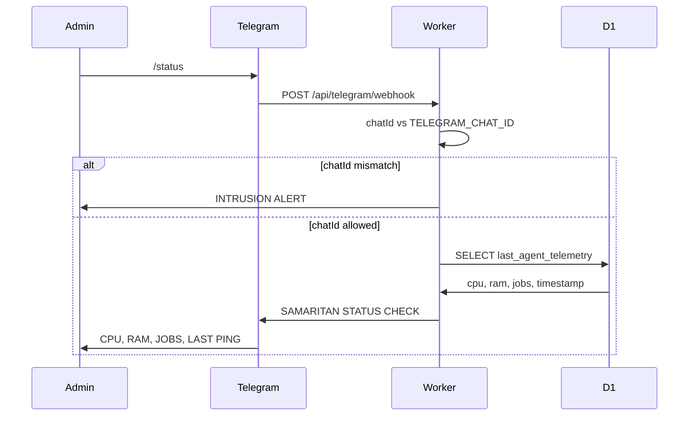

# SAMARITAN: BK VIDEO FACTORY

> **Enterprise-ready** video processing with zero-trust security. Edge-first architecture, hybrid Cloudflare + Hetzner, Samaritan C2, Bodyguard Protocol. Production-grade.

[](https://workers.cloudflare.com/)
[](https://www.python.org/)
[](https://developers.cloudflare.com/d1/)
[](https://developers.cloudflare.com/r2/)
[](https://core.telegram.org/bots/api)
[](./test)
[](LICENSE)

---

## SECURITY NOTICE — CRITICAL

**This repository contains no passwords, API keys, or tokens.**

| Do NOT | Do |
|--------|-----|
| Commit `.dev.vars` | Use `.dev.vars.example` as template (empty placeholders) |
| Hardcode `TELEGRAM_TOKEN`, `R2_SECRET_ACCESS_KEY` | Use `wrangler secret put` or GitHub Actions Secrets |
| Store real credentials in repo | All sensitive data via env/secrets |

**Pre-push check:** Ensure `.dev.vars` and `.env*` are not listed in `git status`. `.gitignore` excludes them.

See [.dev.vars.example](.dev.vars.example) for required variables.

---

## Vision

BK Video Factory is an **Edge-First** video processing platform built on Cloudflare Workers, D1, and R2, with a Hetzner-based Python agent for FFmpeg transcode. The **Samaritan** layer provides Telegram C2 (Command & Control) for admin monitoring and real-time alerts. The **Bodyguard Protocol** actively protects the primary Entegra SaaS by enforcing a RAM cage: 28 GB warning, 31.5 GB hard-kill (`os._exit`) before OOM-Killer can strike the host. Zero-trust, production-grade.

---

## Architecture

### Edge-First Pipeline



### Bodyguard Protocol — /status Flow



---

## Key Features (The Shield & The Sword)

| Feature | Description |
|---------|-------------|
| **Telegram Interactive C2** | `/status` command returns real-time system report (CPU, RAM, jobs, last ping); intrusion detection fires alert for unauthorized chat IDs |
| **Bodyguard Protocol (Sacrifice Play)** | 28 GB RAM warning (5 min cooldown); 31.5 GB hard-kill (`os._exit(1)`) + Telegram CRITICAL to protect Entegra primary SaaS before OOM-Killer |
| **Native Quality Stack** | CRF 10 (orijinal) / 12 (ultra) / 14 (dengeli, varsayılan) / 16 (standart) / 18 (küçük dosya); `web_opt` = copy (kalite/FPS değişmez). Bitrate/FPS kaynak korunur. |
| **High-Performance Pipeline** | Chunked streaming (1 MB), FFmpeg `-preset slow`, 4 parallel jobs (ThreadPoolExecutor) |
| **R2-D1 Storage Integrity** | Raw dosya D1'e COMPLETED yazılmadan önce R2'den silinmesi garantilenir; silme başarısız olursa iş COMPLETED olmaz. `POST /api/admin/cleanup-r2` ile R2-D1 uyumsuzlukları denetlenip temizlenir. |
| **Dead Man's Switch** | 12 min ping gap → LOSS OF SIGNAL Telegram alert (Cron watchdog) |
| **Asset Preview** | Thumbnail + caption sent to Telegram on job completion |
| **5 GB Upload** | Presigned R2 URL; direct upload from client |

---

## API Documentation

### Samaritan Ping (Agent Telemetry Ingest)

| Property | Value |
|----------|-------|
| Endpoint | `POST /api/samaritan/ping` |
| Auth | `X-Samaritan-Secret` header |
| Content-Type | `application/json` |

**Request body (JSON):**

| Field | Type | Description |
|-------|------|-------------|
| cpu | number | CPU usage (%) |
| ram | number | RAM used (GB) |
| uptime_hours | number | Agent uptime |
| jobs | number | Active jobs |
| node | string | Node identifier (e.g. "Primary Core") |
| timestamp | string | ISO timestamp |

### Telegram Webhook (C2)

| Property | Value |
|----------|-------|
| Endpoint | `POST /api/telegram/webhook` |
| Auth | `TELEGRAM_CHAT_ID` whitelist (message.chat.id) |
| Content-Type | `application/json` (Telegram Update object) |

**Supported command:** `/status` → returns SAMARITAN STATUS CHECK (CPU, RAM, JOBS, LAST PING).

**Unauthorized chat IDs:** Triggers INTRUSION ALERT to Admin.

**Upload / URL import:** Request body’de `processingProfile` (opsiyonel): `crf_10` | `crf_12` | `crf_14` | `crf_16` | `crf_18` | `web_opt`. Verilmezse varsayılan `crf_14`.

### R2 Storage Cleanup (Admin)

| Property | Value |
|----------|-------|
| Endpoint | `POST /api/admin/cleanup-r2` |
| Auth | Root only (session cookie) |
| Content-Type | no body required |

**Response:** `{ "deleted_raw_count": N, "deleted_trash_count": M }`

- `deleted_raw_count` — R2_RAW_UPLOADS_BUCKET'ta olup D1'de aktif isi olmayan raw dosyalari siler.
- `deleted_trash_count` — R2_DELETED_BUCKET'ta olup D1'de DELETED kaydi bulunmayan nesneleri siler.
- Cursor-pagination ile bucket boyutundan bagimsiz calisir.
---

## Scalability & Cloud Hybrid

- **Cloudflare Edge:** Global API, D1 (SQLite), R2 object storage; low latency, automatic scaling
- **Hetzner Agent:** Compute-heavy FFmpeg transcode; 4 parallel jobs, kademeli uyku (idle 1h → deep 24h)
- **Hybrid model:** Edge handles routing, auth, presigned URLs; Agent handles CPU-intensive encode

---

## Installation

### Requirements

- Node.js 18+
- Wrangler CLI
- Cloudflare account (Workers, D1, R2)
- Python 3.11+ (for agent)

### Setup

```bash
git clone https://github.com/YOUR_ORG/bk-video-factory.git
cd bk-video-factory
npm install
cp .dev.vars.example .dev.vars
```

Edit `.dev.vars` with your values. **Never commit `.dev.vars`.**

### Secrets (Placeholders Only)

| Secret | Description |
|--------|-------------|
| `BK_BEARER_TOKEN` | Agent/Worker auth (Bearer) |
| `TELEGRAM_TOKEN` | Telegram Bot API token |
| `TELEGRAM_CHAT_ID` | Admin chat ID |
| `SAMARITAN_SECRET` | Agent ping auth (`X-Samaritan-Secret`) |
| `R2_ACCOUNT_ID` | Cloudflare R2 account ID |
| `R2_ACCESS_KEY_ID` | R2 API key |
| `R2_SECRET_ACCESS_KEY` | R2 API secret |

**Production:** `wrangler secret put SECRET_NAME` for each.

### Deploy

```bash
# D1 migrations (first deploy or new migrations)
npx wrangler d1 migrations apply bk-video-db --remote

# Deploy
npm run deploy
```

### Local Development

```bash
npm run dev
```

### Tests

Testler Vitest ile çalışır; otomatik test altyapısı mevcut.

```bash
npm install
npm run test        # watch
npm run test:run    # tek sefer, CI için
```

**Kapsam:** Public → Deleted taşıma mantığı, D1 `batch()` transaction başarısı, SSRF / R2 key validasyonu, presigned URL, job state machine, **processing_profile** (varsayılan crf_14, geçerli preset’ler). Tüm testlerin **PASS** olması teslim öncesi doğrulanır.

---

## Project Structure

```
bk/
├── src/              # Cloudflare Worker
│   ├── index.js      # Entry, cron
│   ├── routes/       # API handlers
│   ├── services/     # VideoService, AuthService
│   └── utils/        # dto, errors
├── public/           # Static assets (dashboard, upload)
├── hetner-agent/     # Python FFmpeg worker (canlıda sadece bk_agent_v2 kullanılır)
│   ├── bk_agent_v2.py   # Aktif agent — Native preset (CRF 10–18, web_opt)
│   ├── video_config.py  # Sabitler (config.js ile senkron)
│   └── archive/         # Eski sürümler (referans; deploy edilmez)
├── migrations/       # D1 migrations
├── docs/             # Architecture, Samaritan, Database
├── wrangler.toml
└── .dev.vars.example
```

**Güncel sürüm:** [CHANGELOG](CHANGELOG.md) — 12.1.0 R2-D1 Storage Integrity & Admin Cleanup API.

---

## Additional Documentation

| Document | Description |
|----------|-------------|
| [docs/ARCHITECTURE.md](docs/ARCHITECTURE.md) | Components, R2 structure, data flow |
| [docs/SAMARITAN.md](docs/SAMARITAN.md) | Alarm types, configuration, flows |
| [docs/DATABASE.md](docs/DATABASE.md) | D1 schema, tables, migrations |
| [CHANGELOG.md](CHANGELOG.md) | Version history |

---

## License

MIT — see [LICENSE](LICENSE).

---

**BK Video Factory** — [Bilge Karga](https://bilgekarga.com.tr) | TARGET NODE: Primary Core  
*v.bilgekarga.tr adresine gelenler bilgekarga.com.tr'ye yönlendirilir.*
