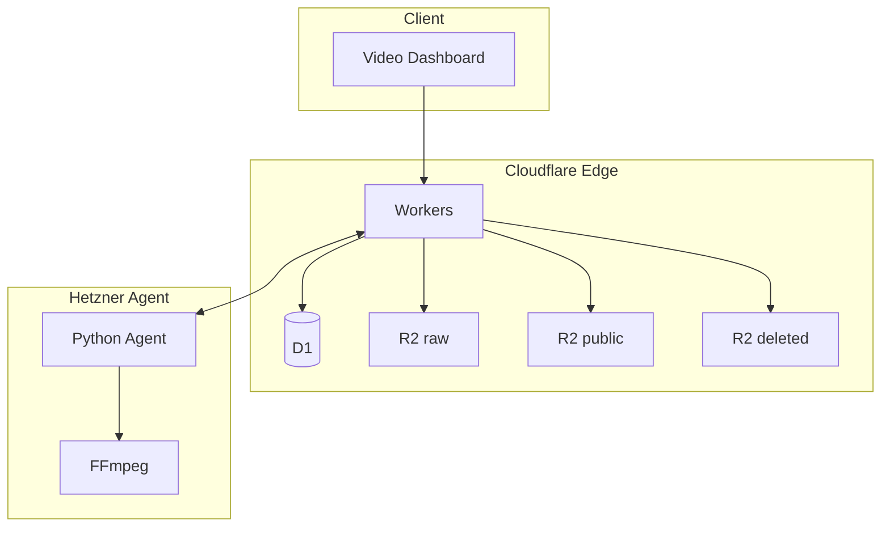
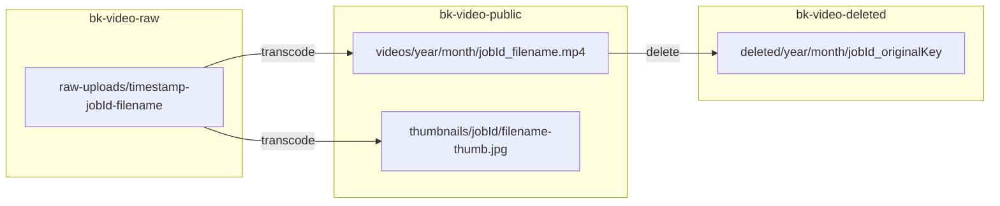

# BK Video Factory — Mimari Belgesi

## 1. Genel Bakış

BK Video Factory üç katmandan oluşur:

1. **Edge (Cloudflare)** — API, auth, R2 presigned, D1, cron
2. **Agent (Hetzner)** — Python + FFmpeg, video transcode
3. **Client** — Browser dashboard (Vanilla JS)

---

## 2. Bileşenler

### 2.1 Cloudflare Worker (src/index.js)

- **Görev:** Request routing, CORS, security headers, cron
- **Cron:** Günlük cleanup, zombi işaretleme, Samaritan DMS (12 dk aşımında LOSS OF SIGNAL)
- **Bindings:** DB (D1), R2_RAW_UPLOADS_BUCKET, R2_PUBLIC_BUCKET, R2_DELETED_BUCKET, ASSETS

### 2.2 Route Dispatcher (src/routes/index.js)

| Path Ön Eki | Handler | Auth |
|-------------|---------|------|
| /api/login, /api/me, /api/logout | handleAuthRoutes | - |
| /api/users | handleUserRoutes | root |
| /api/r2 | handleR2Routes | root |
| /api/security/* | handleSecurityLogs vb. | admin |
| /api/folders | handleFolderRoutes | admin |
| /api/samaritan/ping | handleSamaritanPing | X-Samaritan-Secret |
| /api/telegram/webhook | handleTelegramWebhook | TELEGRAM_CHAT_ID |
| /api/videos, /api/jobs | handleVideoRoutes | Bearer/Cookie |

### 2.3 VideoService (src/services/VideoService.js)

- Presigned URL üretimi (R2)
- Job oluşturma, tamamlama
- Kalıcı silme (raw + public + deleted bucket)
- Soft delete / restore
- URL import (source_url)
- Cleanup (eski videolar)

### 2.4 Hetner Agent (hetner-agent/bk_agent_v2.py)

- **Concurrency:** 4 paralel job (ThreadPoolExecutor)
- **Uyku stratejisi:** Active 60s → Idle 3600s → Deep1 21600s → Deep2 86400s
- **Wakeup:** POST /wakeup (port 8080, Bearer token)
- **Akış:** claim → download (raw veya URL) → FFmpeg → R2 upload → complete → Samaritan preview

---

## 3. R2 Bucket Yapısı

| Bucket | Kullanım |
|--------|----------|
| bk-video-raw | Ham yüklemeler (raw-uploads/...) |
| bk-video-public | İşlenmiş videolar + thumbnail (videos/, thumbnails/) |
| bk-video-deleted | Soft-delete geçici depolama |

**CDN:** cdn.bilgekarga.tr → R2 public bucket custom domain

---

## 4. Veri Akışı Detayları

### 4.1 Presigned Upload

1. Client → POST /api/videos/upload/presigned (filename, quality, folder_id, ...)
2. Worker → D1: INSERT conversion_jobs (PENDING), INSERT upload_tokens
3. Worker → R2: createMultipartUpload veya putObject presigned URL
4. Worker → Client: presigned PUT URL
5. Client → R2: PUT (direct upload)
6. Client → POST /api/videos/upload/complete
7. Worker → D1: UPDATE job, DELETE token

### 4.2 Agent Processing

1. Agent → POST /api/jobs/claim (Bearer)
2. Worker → D1: UPDATE status=PROCESSING, worker_id
3. Agent → R2: GET raw (presigned)
4. Agent → FFmpeg: transcode
5. Agent → R2: PUT public + thumbnail (presigned)
6. Agent → POST /api/jobs/complete
7. Agent → Telegram: _send_asset_preview_telegram (ASSET ACQUIRED)

---

## 5. Güvenlik Katmanları

| Katman | Uygulama |
|--------|----------|
| Auth | Bearer token, Cookie, requireRoot/requireAuth |
| Rate Limit | D1 rate_limit_counters, in-memory fallback |
| SSRF | URL validation (metadata hosts, private IP blocklist) |
| RBAC | root: users, r2, security; admin: videos, folders |
| Samaritan | Intrusion alert (webhook), API Security alert (401/403) |

---

## 6. Konfigürasyon

| Sabit | Değer | Konum |
|-------|-------|-------|
| MAX_FILE_SIZE_BYTES | 5 GB | config.js, video_config.py |
| JOB_PROCESSING_TIMEOUT_MINUTES | 60 | config.js |
| ZOMBIE_TIMEOUT_MINUTES | 45 | cron |
| Max kullanıcı | 5 | UserRepository |

---

*Belge: BK Video Factory mimari referansı.*
