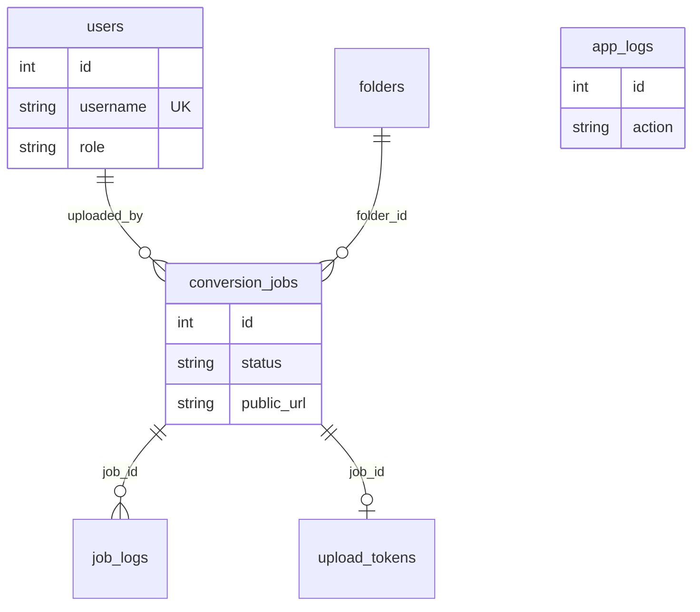

# BK Video Factory — Veritabanı (D1) Belgesi

## 1. Genel Bilgi

- **Engine:** Cloudflare D1 (SQLite)
- **Database name:** bk-video-db
- **Binding:** DB
- **Migrations:** `./migrations/` (wrangler.toml)
- **Referans şema:** `master_schema.sql`

---

## 2. Tablo Listesi

| Tablo | Açıklama |
|-------|----------|
| config | Uygulama ayarları (key-value) |
| links | Legacy (kullanılmıyor) |
| logs | Genel log |
| url_hash_cache | URL hash önbelleği |
| folders | Klasör yapısı |
| users | RBAC (root/admin) |
| conversion_jobs | Video işleri |
| job_logs | İş adım logları |
| daily_statistics | Günlük istatistik |
| worker_heartbeats | Agent heartbeat |
| security_logs | Güvenlik olayları |
| banned_ips | IP ban listesi |
| system_stats | Sistem metrikleri |
| admin_users | 2FA (legacy) |
| rate_limit_counters | Rate limit |
| upload_tokens | Presigned upload token |
| app_logs | Append-only audit log |
| conversion_jobs_fts | FTS5 arama |

---

## 3. conversion_jobs

**Ana video iş tablosu.**

| Sütun | Tip | Açıklama |
|-------|-----|----------|
| id | INTEGER PK | |
| original_name | TEXT | Orijinal dosya adı |
| clean_name | TEXT | Temizlenmiş ad |
| r2_raw_key | TEXT | R2 raw bucket key |
| public_url | TEXT | CDN video URL |
| quality | TEXT | 720p, 1080p, ... |
| status | TEXT | PENDING, PROCESSING, COMPLETED, FAILED |
| worker_id | TEXT | Agent worker ID |
| thumbnail_key | TEXT | R2 thumbnail key |
| uploaded_by | TEXT FK | users(username) |
| folder_id | INTEGER FK | folders(id) |
| processing_profile | TEXT | crf_10..crf_18, web_opt |
| ... | | |

**Status akışı:**
```
PENDING → PROCESSING → (DOWNLOADING|CONVERTING|UPLOADING) → COMPLETED
                                                    ↘ FAILED
                                                    ↘ INTERRUPTED
COMPLETED/FAILED → DELETED (soft delete) → [purge] → hard delete
```

**r2_raw_key davranışı:** İş `COMPLETED` olmadan önce `R2_RAW_UPLOADS_BUCKET` üzerindeki raw dosya silinir. Silme başarısız olursa D1 güncellenmez; iş `COMPLETED` olmaz. `PENDING`, `URL_IMPORT_QUEUED`, `PROCESSING`, `DOWNLOADING`, `CONVERTING`, `UPLOADING` durumundaki işlerin raw dosyaları korunur.

---

## 4. app_logs

**Append-only audit log.** Hash chain ile tahrifat tespiti.

| Sütun | Tip | Açıklama |
|-------|-----|----------|
| id | INTEGER PK | |
| created_at | TEXT | datetime |
| level | TEXT | info, warn, error |
| action | TEXT | LOG_ACTION |
| job_id | INTEGER | Opsiyonel |
| details_json | TEXT | JSON |
| ip | TEXT | |
| user_id | TEXT | |
| request_id | TEXT | |
| prev_hash | TEXT | Hash chain |
| entry_hash | TEXT | Hash chain |

**İndeksler:** created_at, action, job_id, request_id

---

## 5. İlişkiler



---

## 6. Migration Komutları

```bash
# Tüm migration'ları uygula
npx wrangler d1 migrations apply bk-video-db --remote

# Belirli migration dosyasını doğrudan çalıştır
npx wrangler d1 execute bk-video-db --remote --file=migrations/010_app_logs.sql

# Migration durumunu listele
npx wrangler d1 migrations list bk-video-db --remote
```

---

## 7. Admin API — R2 Storage Cleanup

`POST /api/admin/cleanup-r2` (root only):

| Eylem | Kriter | Bucket |
|-------|--------|--------|
| Raw sil | D1'de PENDING/PROCESSING dışında olan veya kayıtsız tüm raw objeler | R2_RAW_UPLOADS_BUCKET |
| Trash sil | D1'de DELETED kaydı olmayan tüm objeler | R2_DELETED_BUCKET |

Dönüş: `{ deleted_raw_count, deleted_trash_count }`

---

## 8. Önemli Notlar

- **FK sırası:** `users` tablosu `conversion_jobs`'dan önce oluşturulmalı (uploaded_by FK)
- **app_logs:** Migration 010 ile eklenir; master_schema.sql ile senkron
- **FTS5:** conversion_jobs_fts, content='conversion_jobs', content_rowid='id'
- **R2-D1 bütünlüğü:** `completeJob` raw silme → D1 yazma sırasını atomik olarak zorlar; her ikisi de başarılı olmadan iş COMPLETED olmaz

---

*Belge: D1 veritabanı referansı.*
