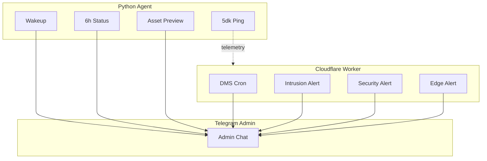
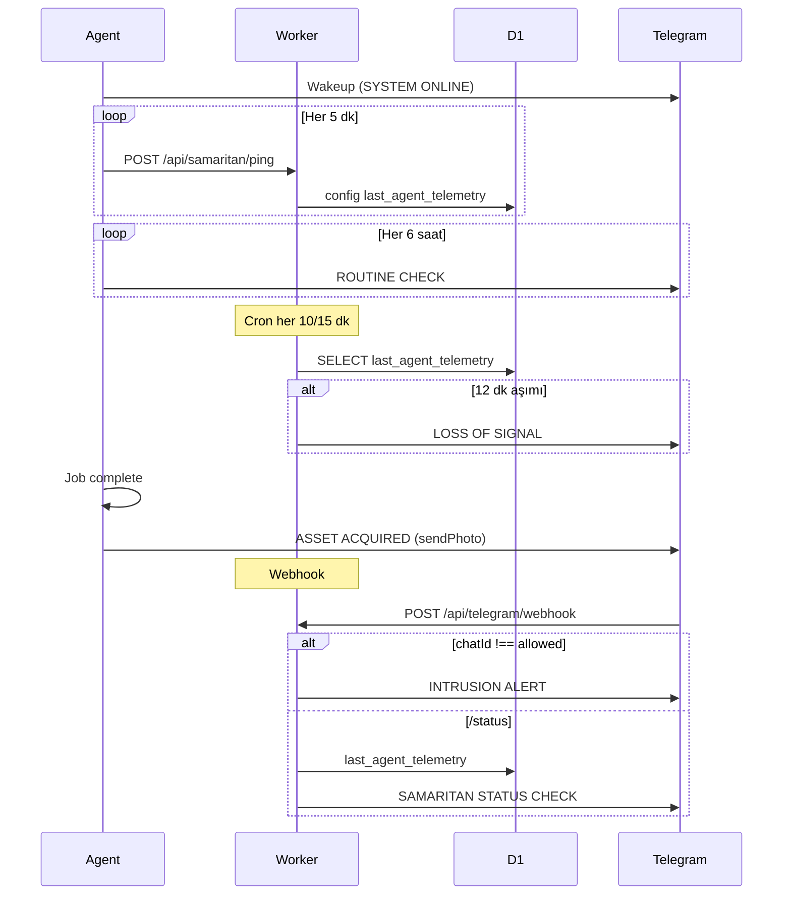

# Samaritan Sistemi — Detaylı Belge

## 1. Amaç

Samaritan, POI (Person of Interest) temasında merkezi izleme ve alarm sistemidir. Agent ve Edge Worker üzerinden Admin'e Telegram ile bildirim gönderir.

---

## 2. Bileşenler



---

## 3. Alarm Türleri

### 3.1 Wakeup (Agent Başlangıç)

**Tetikleyici:** `bk_agent_v2.py` `_samaritan_wakeup()`

**Mesaj:**
```
🟢 SYSTEM ONLINE | NODE: Primary Core
```

### 3.2 ROUTINE CHECK (6 Saat)

**Tetikleyici:** `_samaritan_status_loop` (background thread)

**Mesaj:**
```
💠 ROUTINE CHECK: NODE STABILITY | CPU: %X | RAM: X.X GB | UPTIME: X.Xh | STATUS: OPTIMAL
```

### 3.3 LOSS OF SIGNAL (12 dk Aşımı)

**Tetikleyici:** Cron (scheduled) — `last_agent_telemetry` > 12 dakika

**Mesaj:**
```
🔻 CRITICAL ALERT: LOSS OF SIGNAL
[ \ ] TARGET NODE: Primary Processing Core (Hetzner)
[ ! ] STATUS: MISSING 2 CONSECUTIVE HEARTBEATS.
> DIRECTIVE: NODE PRESUMED DEAD. INITIATING ADMIN WAKE-UP ALARM! 🚨
```

### 3.4 ASSET ACQUIRED (Video Tamamlandı)

**Tetikleyici:** `_send_asset_preview_telegram(job, result)` — iş tamamlandıktan sonra

**Yöntem:** `sendPhoto` (thumbnail URL) veya fallback `sendMessage`

**Mesaj:**
```
> 🎬 ASSET ACQUIRED
[ > ] FILE: {video_name}
[ > ] DURATION: {duration}s
> STATUS: READY FOR DEPLOYMENT.
```

### 3.5 INTRUSION ATTEMPT (Webhook Saldırı)

**Tetikleyici:** `/api/telegram/webhook` — chatId !== TELEGRAM_CHAT_ID

**Mesaj:**
```
> 🔻 INTRUSION ATTEMPT DETECTED
[ ! ] WARNING: UNKNOWN ENTITY TRIED TO ACCESS THE MACHINE.
[ \ ] USER_ID: {intruder_id}
[ \ ] MESSAGE: {intruder_text}
> DIRECTIVE: MONITORING AND LOGGING SOURCE IP.
```

### 3.6 API SECURITY ALERT (Yetkisiz Erişim)

**Tetikleyici:** 401/403 on critical paths: /api/users, /api/r2, /api/security/, /api/folders, /api/logs/app

**Mesaj:**
```
🔺 API SECURITY ALERT
[ \ ] ENDPOINT: {path}
[ \ ] STATUS: {401|403}
[ \ ] IP: {ip}
[ ! ] MESSAGE: {error_message}
> DIRECTIVE: UNAUTHORIZED ACCESS ATTEMPT LOGGED.
```

### 3.7 SYSTEM ANOMALY (500 Edge Hata)

**Tetikleyici:** handleError — statusCode === 500

**Mesaj:**
```
🔺 SYSTEM ANOMALY DETECTED
[ \ ] TARGET NODE: Cloudflare Edge Worker
[ ! ] CRITICAL ERROR: {message}
> STATUS: SYSTEM OVERRIDE NEEDED. SEARCHING FOR ADMIN... 🔎
```

---

## 4. Konfigürasyon

### Agent (bk_agent_v2.py)

| Env | Açıklama | Varsayılan |
|-----|----------|------------|
| TELEGRAM_TOKEN | Bot token | - |
| TELEGRAM_CHAT_ID | Admin chat ID | - |
| SAMARITAN_SECRET | Ping auth | - |
| SAMARITAN_STATUS_INTERVAL | ROUTINE CHECK aralığı (sn) | 21600 (6h) |
| SAMARITAN_PING_INTERVAL | Edge ping aralığı (sn) | 300 (5dk) |

### Worker (wrangler.toml / secrets)

| Secret | Açıklama |
|--------|----------|
| TELEGRAM_TOKEN | Bot token |
| TELEGRAM_CHAT_ID | Admin chat ID |

---

## 5. Telegram Webhook

**URL:** `https://v.bilgekarga.tr/api/telegram/webhook`

**Davranış:**
- Sadece TELEGRAM_CHAT_ID ile eşleşen chat'ten gelen mesajlar işlenir
- `/status` komutu: Agent telemetry (CPU, RAM, jobs, last ping) döner
- TELEGRAM_CHAT_ID dışından gelen mesajlar → INTRUSION alert + 403

**Webhook Ayarı:**
```bash
curl -X POST "https://api.telegram.org/bot<TOKEN>/setWebhook?url=https://v.bilgekarga.tr/api/telegram/webhook"
```

---

## 6. Akış Diyagramı



---

*Belge: Samaritan sistemi referansı.*
